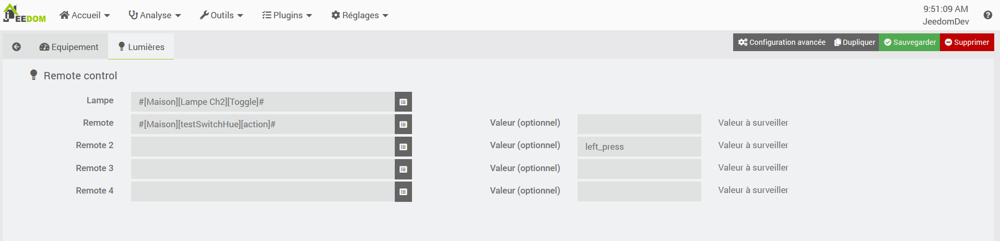

# Plugin Remote Control

Plugin permettant de gérer les télécommandes pour **Jeedom**.

# Introduction 

La gestion des télécommandes se gèrent normalement via des scénarios plus ou moins coomplexe
Ce plugin permet de gérer le ON/OFF, la luminosité et la température couleur d'une lampe.

# Configuration du plugin

La configuration est simple.

## Emplacement

Le plugin s'adapte à l'emplacement de Jeedom.
Il faut donc vérifier que cela est correctement renseigné
Dans le menu Réglages/Système/Configuration, puis dans l'onglet Général, voir la section Coordonnées

## Onglet Lumières

Cet onglet permet de sélectionner la télécommande et la lampe qu'on souhaite gérer.
Il faut alors renseigner 2 informations :
- Remote (1 à 4) : la commande 'action' de la télécommande,
- Lampe : la commandede la lampe pour le toogle.

Il existe une valeur optionnelle à renseigner par remote :
- Valeur : Indiquer la valeur à prendre en compte.
   Exemple : le Hue Switch sur un interrupteur 2 boutons va envoyer l'action left_press et right_press.
   Il peut être souhaité de n'agir uniquement lorsque le bouton gauche est pressé concernant cette lampe.

NOTE : 
- Les types génériques de la lampes doivent être renseignés (LIGHT_TOGGLE, LIGHT_ON, LIGHT_OFF, LIGHT_STATE, LIGHT_BRIGHTNESS, LIGHT_SLIDER, LIGHT_COLOR_TEMP, LIGHT_SET_COLOR_TEMP)
Ceci est fait automatiquement sur les équipements ZigbeeLinker.

# Compatibilité et Incompatibilité

En résumé :
Les télécommandes envoient des commandes toutes différentes.
Ce plugin gère les télécommandes sous zigbeeLinker (et peut-être jMqtt) via la commande 'action', qui semble simplifier les commandes selon les marques de télécommandes.

Il gère aussi mes télécommandes sous Enocean qui donne la valeur 0 ou 1.

Les tests ont été effectués sous ZigbeeLinker, et avec des télécommandes suivantes :
- Hue Dimmer (version 1, sans le bouton Hue)
- Ikea remote control (5 boutons)
- Hue Switch

La lampe testée est une Ikea (zigbeeLinker) et Hue (avec le pont Hue).
